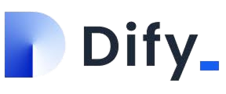
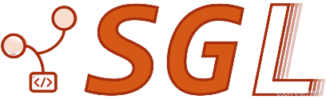
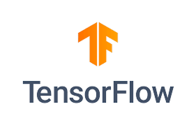

[𝕏 Follow me on X](https://x.com/novita_labs?utm_source=github_collabhub&utm_medium=readme&utm_campaign=collab) • [🤗 Hugging Face](https://huggingface.co/novita?utm_source=github_collabhub&utm_medium=readme&utm_campaign=collab) • [💻 Docs](https://novita.ai/docs/guides/introduction?utm_source=github_collabhub&utm_medium=readme&utm_campaign=collab)

[Novita AI](https://novita.ai?utm_source=github_collabhub&utm_medium=readme&utm_campaign=collab) is an AI cloud platform that helps developers easily deploy AI models through a simple API, backed by affordable and reliable GPU cloud infrastructure.

## **TOP-LLM Integration Repo**

Integrate the Novita API into popular software and platforms. Access [Novita](https://novita.ai/settings/key-management?utm_source=github_collabhub&utm_medium=readme&utm_campaign=collab) to get an API key.

<table>
  <colgroup>
    <col width="100" />
    <col />
    <col width="200" />
  </colgroup>
  <thead>
    <tr>
      <th><strong>Repo</strong></th>
      <th><strong>Description</strong></th>
      <th><strong>Guide</strong></th>
    </tr>
  </thead>
  <tbody>
    <tr>
      <td></td>
      <td>Hugging Face is a library that provides pre-trained language models for NLP tasks. Novita is one of the inference providers of Hugging Face.</td>
      <td><a href="https://novita.ai/docs/guides/huggingface/?utm_source=github_collabhub&utm_medium=readme&utm_campaign=collab">Novita AI & Hugging Face Integration Guide</a></td>
    </tr>
    <tr>
      <td></td>
      <td>LangChain is a framework for developing applications powered by large language models (LLMs).</td>
      <td><a href="https://novita.ai/docs/guides/langchain/?utm_source=github_collabhub&utm_medium=readme&utm_campaign=collab">Novita AI & LangChain Integration Guide</a></td>
    </tr>
    <tr>
      <td></td>
      <td>LobeChat is an open-source, modern-design AI chat framework.</td>
      <td><a href="https://novita.ai/docs/guides/lobechat/?utm_source=github_collabhub&utm_medium=readme&utm_campaign=collab">Novita AI & LobeChat Integration Guide</a></td>
    </tr>
    <tr>
      <td></td>
      <td>Dify is an open-source LLM app development platform.</td>
      <td><a href="https://novita.ai/docs/guides/dify/?utm_source=github_collabhub&utm_medium=readme&utm_campaign=collab">Novita AI & Dify Integration Guide</a></td>
    </tr>
    <tr>
      <td></td>
      <td>Langflow is a low-code app builder for RAG and multi-agent AI applications.</td>
      <td><a href="https://novita.ai/docs/guides/langflow/?utm_source=github_collabhub&utm_medium=readme&utm_campaign=collab">Novita AI & Langflow Integration Guide</a></td>
    </tr>
    <tr>
      <td></td>
      <td>AnythingLLM is an all-in-one Desktop & Docker AI application with built-in RAG, AI agents, No-code agent builder, and more.</td>
      <td><a href="https://novita.ai/docs/guides/anythingllm/?utm_source=github_collabhub&utm_medium=readme&utm_campaign=collab">Novita AI & AnythingLLM Integration Guide</a></td>
    </tr>
    <tr>
      <td></td>
      <td>Continue is the leading open-source AI code assistant.</td>
      <td><a href="https://novita.ai/docs/guides/continue/?utm_source=github_collabhub&utm_medium=readme&utm_campaign=collab">Novita AI & Continue Integration Guide</a></td>
    </tr>
    <tr>
      <td></td>
      <td>Skyvern can automate browser-based workflows with LLMs and Computer Vision.</td>
      <td><a href="https://novita.ai/docs/guides/skyvern/?utm_source=github_collabhub&utm_medium=readme&utm_campaign=collab">Novita AI & Skyvern Integration Guide</a></td>
    </tr>
    <tr>
      <td></td>
      <td>Helicone is an open-source LLM observability platform.</td>
      <td><a href="https://novita.ai/docs/guides/helicone/?utm_source=github_collabhub&utm_medium=readme&utm_campaign=collab">Novita AI & Helicone Integration Guide</a></td>
    </tr>
  </tbody>
</table>

## **Novita Instance Templates**

Templates are Docker container images paired with a configuration. They are used to launch images as instances, define the required container disk size, volume, volume paths, and ports needed. You can also define environment variables within the template.

<table>
  <colgroup>
    <col width="100" />
    <col />
    <col width="200" />
  </colgroup>
  <thead>
    <tr>
      <th><strong>Repo</strong></th>
      <th><strong>Description</strong></th>
      <th><strong>Template</strong></th>
    </tr>
  </thead>
  <tbody>
    <tr>
      <td></td>
      <td>vLLM is a high-throughput and memory-efficient inference and serving engine for LLMs.</td>
      <td><a href="https://novita.ai/gpus-console/explore?templateId=304?utm_source=github_collabhub&utm_medium=readme&utm_campaign=collab">Run DeepSeek-R1-Distill-Qwen-1.5B with vLLM on Novita</a></td>
    </tr>
    <tr>
      <td></td>
      <td>SGLang is a fast serving framework for large language models and vision language models.</td>
      <td><a href="https://novita.ai/gpus-console/explore?templateId=310?utm_source=github_collabhub&utm_medium=readme&utm_campaign=collab">Run Llama3.1-8B-Instruct with SGLang on Novita</a></td>
    </tr>
    <tr>
      <td></td>
      <td>TensorFlow is an open-source machine learning framework for everyone.</td>
      <td><a href="https://novita.ai/gpus-console/explore?templateId=269?utm_source=github_collabhub&utm_medium=readme&utm_campaign=collab">Run Tensorflow:2.7.0 on Novita</a></td>
    </tr>
    <tr>
      <td></td>
      <td>PyTorch offers tensors and dynamic neural networks in Python with strong GPU acceleration.</td>
      <td><a href="https://novita.ai/gpus-console/explore?templateId=268?utm_source=github_collabhub&utm_medium=readme&utm_campaign=collab">Run Pytorch:2.2.1 on Novita</a></td>
    </tr>
    <tr>
      <td></td>
      <td>Flux contains minimal inference code to run image generation & editing with our Flux models.</td>
      <td><a href="https://novita.ai/gpus-console/explore?templateId=301?utm_source=github_collabhub&utm_medium=readme&utm_campaign=collab">Run comfyui:flux1-fp8 with Flux on Novita AI</a></td>
    </tr>
    <tr>
      <td></td>
      <td>Stabel Diffusion offers high-resolution image synthesis with latent diffusion models.</td>
      <td><a href="https://novita.ai/gpus-console/explore?templateId=298?utm_source=github_collabhub&utm_medium=readme&utm_campaign=collab">Run StableDiffusion:v1.8.0 on Novita AI</a></td>
    </tr>
    <tr>
      <td></td>
      <td>FaceFusion is the industry-leading face manipulation platform.</td>
      <td><a href="https://novita.ai/gpus-console/explore?templateId=299?utm_source=github_collabhub&utm_medium=readme&utm_campaign=collab">Run Facefusion:v3.1.1  on Novita AI</a></td>
    </tr>
    <tr>
      <td></td>
      <td>CUDA-Samples offer samples for CUDA Developers which demonstrate features in CUDA Toolkit.</td>
      <td><a href="https://novita.ai/gpus-console/explore?templateId=270?utm_source=github_collabhub&utm_medium=readme&utm_campaign=collab">Run cuda:11.8.0 with CUDA-Samples on Novita AI</a></td>
    </tr>
    <tr>
      <td></td>
      <td>KoboldCpp runs GGUF models easily with a KoboldAI UI with one file and zero Install.</td>
      <td><a href="https://novita.ai/gpus-console/explore?templateId=300&productId=4/?utm_source=github_collabhub&utm_medium=readme&utm_campaign=collab">Run KoboldCpp on Novita AI</a></td>
    </tr>
  </tbody>
</table>

## **Getting Started**

Learn about how to use Novita AI in the [docs](https://novita.ai/docs/guides/introduction/?utm_source=github_collabhub&utm_medium=readme&utm_campaign=collab).

## **License**

[https://opensource.org/license/MIT](https://opensource.org/license/MIT)

## **Get in Touch**

- Email:  [iris@novita.ai](mailto:iris@novita.ai)
- Discord: [novita.ai](https://discord.com/invite/a3vd9r3uET)

We're excited to hear from you and work together to build a better cloud ecosystem. At Novita AI, we believe in the strength of teamwork. Let's start a new journey in cloud computing together!